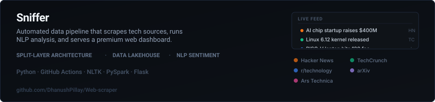
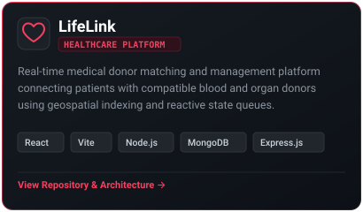

  

  

    
    
    
    
    
  

---

### Overview

I am a **Cloud & Big Data Engineer** and **Machine Learning Systems Developer** based at MIT ADT University. My engineering focus centers on building resilient distributed data pipelines, multi-modal AI frameworks, and scalable production platforms. I actively contribute to foundational open-source machine learning infrastructure including Hugging Face `transformers` and Deepset `haystack`.

- **Core Engineering:** Distributed Systems · Multi-Modal Machine Learning · High-Throughput Pipelines
- **Active Research:** Macroeconomic Predictive Modeling · Retrieval-Augmented Generation (RAG) Architecture
- **Inquiries:** [dhanushpillay28@gmail.com](mailto:dhanushpillay28@gmail.com)

<!-- ### Open Source Engineering

<table width="100%">
  <tr>
    <td width="12%" align="center" valign="middle">
      
    </td>
    <td width="88%" valign="top">
      <strong><a href="https://github.com/huggingface/transformers">huggingface / transformers</a></strong> &nbsp;<code>130k+ Stars</code>
       <em>Core contributions to the industry-standard multi-modal NLP &amp; vision framework.</em>
      <ul>
        <li>Patched tensor integrity in <code>compressed_tensors.py</code> to ensure stable low-bit quantization operations <a href="https://github.com/huggingface/transformers/pull/47701">(#47701)</a></li>
        <li>Enhanced NPU (Neural Processing Unit) detection logic within testing suites for custom hardware acceleration <a href="https://github.com/huggingface/transformers/pull/47587">(#47587)</a></li>
      </ul>
    </td>
  </tr>
  <tr>
    <td width="12%" align="center" valign="middle">
      
    </td>
    <td width="88%" valign="top">
      <strong><a href="https://github.com/deepset-ai/haystack">deepset-ai / haystack</a></strong> &nbsp;<code>16k+ Stars</code>
       <em>Engineering additions to the enterprise framework for RAG and agentic LLM pipelines.</em>
      <ul>
        <li>Implemented <code>link_format</code> in PDF parsing modules to preserve hyperlinks during document ingestion <a href="https://github.com/deepset-ai/haystack/pull/12273">(#12273)</a></li>
        <li>Refactored generator components to strict <code>mypy</code> type checking for robust CI/CD pipelines <a href="https://github.com/deepset-ai/haystack/pull/12216">(#12216)</a></li>
      </ul>
    </td>
  </tr>
</table>
-->

---

### Featured Systems & Architecture

  
    
  
    
  

---

### Technical Arsenal

  

